# ScoutAI: Technical Architecture & Pipeline Overview

This document provides a comprehensive look at the ScoutAI system architecture. It details the data flow from raw video input to clinical analytics and the underlying technology stack that powers the platform.

---

## 1. System Pipeline Flowchart
This diagram illustrates the end-to-end processing logic, from initialization to the final compressed output.

```mermaid
flowchart TD
    classDef init fill:#e1f5fe,stroke:#0277bd,stroke-width:2px,color:black,font-weight:bold;
    classDef loop_control fill:#ffe0b2,stroke:#ef6c00,stroke-width:2px,color:black,font-weight:bold;
    classDef batch_gpu fill:#ffcdd2,stroke:#c62828,stroke-width:3px,color:black,font-weight:bold,stroke-dasharray: 5 5;
    classDef tracking fill:#d1c4e9,stroke:#4527a0,stroke-width:2px,color:black;
    classDef physics fill:#d9b3ff,stroke:#6600cc,stroke-width:3px,color:black,font-weight:bold;
    classDef logic fill:#c8e6c9,stroke:#2e7d32,stroke-width:2px,color:black;
    classDef drawing fill:#fff9c4,stroke:#fbc02d,stroke-width:2px,color:black;
    classDef export fill:#cfd8dc,stroke:#37474f,stroke-width:2px,color:black,font-weight:bold;
    classDef startend fill:#333,stroke:#fff,stroke-width:4px,color:#fff,font-weight:bold;

    Start((Start Analysis)):::startend --> Phase1

    subgraph Phase1 [Phase 1: Initialization & Loading]
        direction TB
        A1[Load Video File]:::init --> A2[Load Ultralytics Models]:::init
        A2 --> A3[Initialize Components:<br/>One Euro Smoother, BallVelocityTracker]:::init
        A3 --> A4[Start Async Video Writer Thread]:::export
    end

    Phase1 --> Phase2

    subgraph Phase2 [Phase 2: Batched Processing Loop]
        direction TB
        
        FrameCheck{Read Next<br/>Batch of N Frames?}:::loop_control
        
        FrameCheck -- Yes --> BatchInfer
        
        subgraph BatchInfer [GPU Batch Inference Phase]
            direction LR
            ObjDetect[YOLO Object Detection<br/>Batch of N Frames]:::batch_gpu
            PoseDetect[YOLO Pose Estimation<br/>Batch of N Frames]:::batch_gpu
        end
        
        BatchInfer --> SeqLoop
        
        subgraph SeqLoop [Per-Frame Sequential Post-Processing]
            direction TB
            
            ObjTrack[Update Stable Object Tracker<br/>Map BoT-SORT to IDs]:::tracking
            
            Euro[Apply One Euro Filter<br/>Adaptive Anti-Jitter Smoothing]:::physics
            
            Calib[Live Calibration<br/>Update Pixels-per-Meter]:::logic
            
            BallPhys[BallVelocityTracker<br/>Compute Δv & Direction Change]:::physics
            
            DrillMetrics[[compute_drill_metrics<br/>Proximity + Velocity Touch Logic]]:::logic
            
            Visuals[Build Overlay & Draw Bounding Boxes]:::drawing
            
            ObjTrack --> Euro --> Calib --> BallPhys --> DrillMetrics --> Visuals
        end
        
        SeqLoop --> WorkerQueue[(Queue N Frames to<br/>Writer Thread)]:::export
        WorkerQueue -. Loop back .-> FrameCheck
    end

    FrameCheck -- "No (EOF)" --> Phase3

    subgraph Phase3 [Phase 3: Teardown & Export]
        direction TB
        F1[Wait for Writer Thread<br/>to empty queue]:::export --> F2[generate_report<br/>Compile Final JSON Dict]:::logic
        F2 --> F3[Save JSON Report to Disk]:::export
        F3 --> F4[FFmpeg Video Compression<br/>Reduce MP4 file size]:::export
    end

    Phase3 --> End((Finish Analysis)):::startend
```

---

## 2. Technology Stack

### 2.1. AI & Perception
*   **Ultralytics YOLOv8**: Primary engine for object detection (cones, balls, goals) and pose estimation (17-keypoint COCO).
*   **MediaPipe (BlazePose)**: Alternative pose backend with 33-keypoint 3D body tracking.
*   **FP16 Mixed Precision**: Half-precision inference for ~30-40% speed gain on NVIDIA GPUs.
*   **GPU Batch Inference**: Multiple frames processed simultaneously to maximize GPU utilization.

### 2.2. Tracking & Stability
*   **BoT-SORT**: Multi-object tracker integrated via Ultralytics `.track()` API.
*   **StableIDTracker**: Custom spatial re-identification to maintain consistent IDs when BoT-SORT reassigns.
*   **WaypointTracker**: Tracks player progression through fixed cone journeys, computing per-leg speed from known distances.

### 2.3. Analytics & Physics
*   **One Euro Filter**: Speed-adaptive keypoint smoothing — heavy when still, light when moving.
*   **BallVelocityTracker**: Physics-based touch validation using velocity spikes and direction changes.
*   **CalibrationManager**: Dual-strategy pixel-to-metre calibration (ball diameter primary, player height fallback).
*   **HomographyCalibrator**: Perspective transform from known cone formations for drills with fixed geometry.

### 2.4. Processing Infrastructure
*   **OpenCV**: Image I/O, coordinate transforms, and video encoding (mp4v codec).
*   **Async Video Writer**: Blocking `Queue`-based thread for non-blocking frame writes — zero CPU waste.
*   **FFmpeg (libx264)**: Automated post-analysis video compression with graceful fallback.

---
*Document Version: 1.3*
