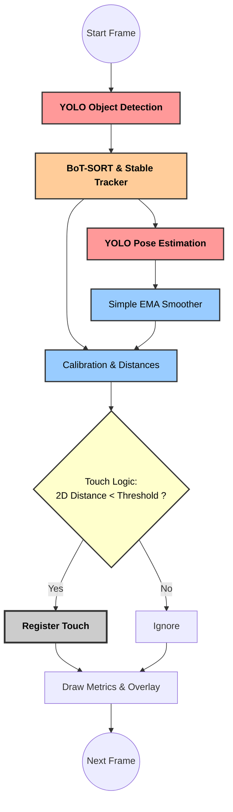
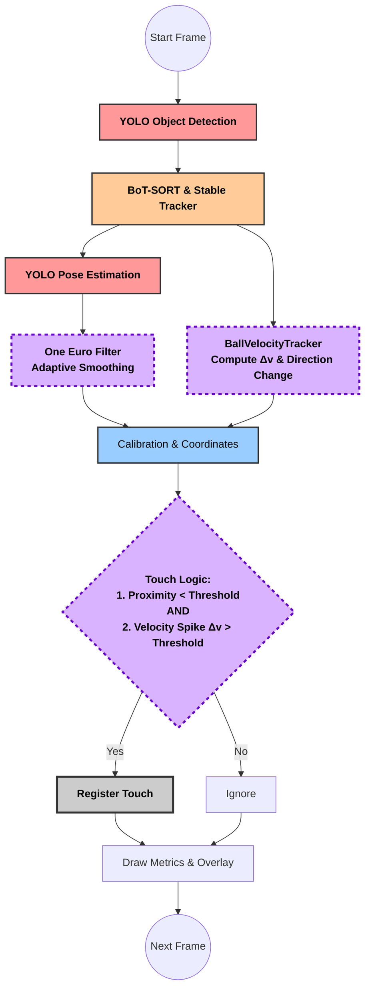

# ScoutAI Pipeline Architecture

This document illustrates the evolution of the ScoutAI processing pipeline, showing the upgrades from the initial design to the current production system.

## 1. Legacy Pipeline (v0.x — Replaced)

The original system used simple coordinate bounds, 2D Euclidean distances, and a fixed-weight Exponential Moving Average (EMA) smoother. This led to jittery poses and frequent false-positive touch detections.

**Problems with this approach:**
- EMA smoother applied equal smoothing regardless of movement speed → lag during fast motion
- Touch detection relied solely on proximity → false positives when ball is near foot without contact
- Single-frame inference → underutilized GPU

---

## 2. Current Pipeline (v1.x — Production)

The current system separates **Perception** (GPU inference) from **Reasoning** (CPU post-processing). Key upgrades: GPU batching, One Euro Filter, and physics-based ball velocity tracking.

**What changed:**

| Component | Before | After |
|---|---|---|
| Pose smoothing | Fixed-weight EMA | One Euro Filter (speed-adaptive) |
| Touch detection | Proximity only | Proximity + velocity spike + direction change |
| GPU inference | 1 frame at a time | Batched (N frames) |
| Precision | FP32 | FP16 (half) |
| Video writing | Synchronous | Async thread with blocking Queue |
| Overlay blending | Full frame copy | ROI-only copy |
